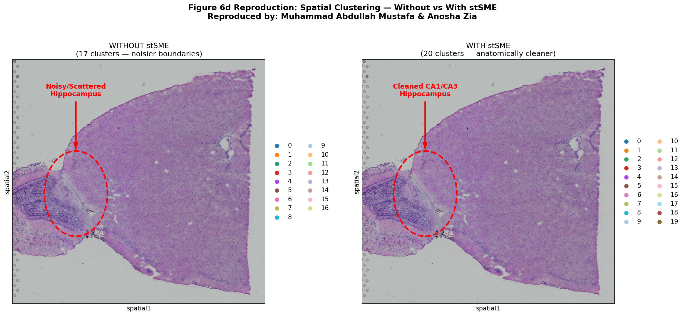
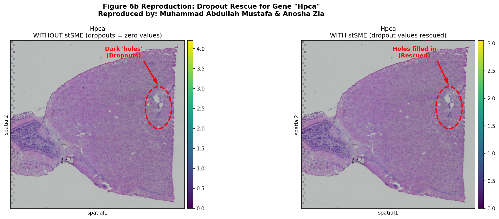
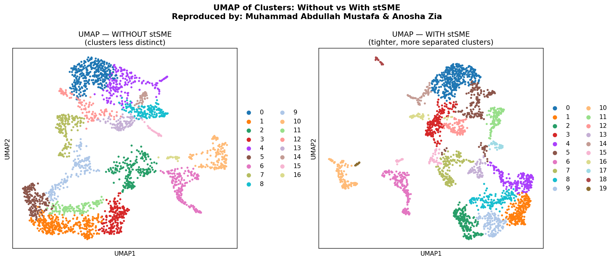
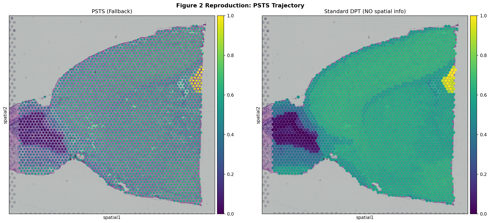
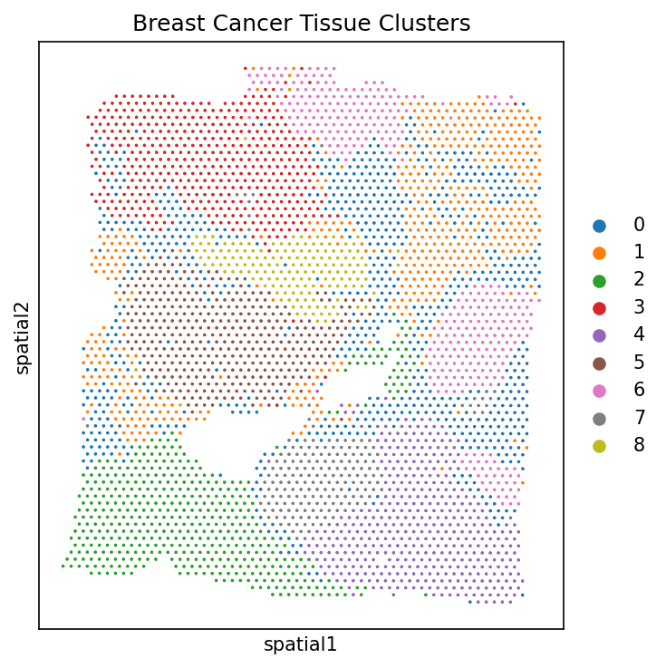
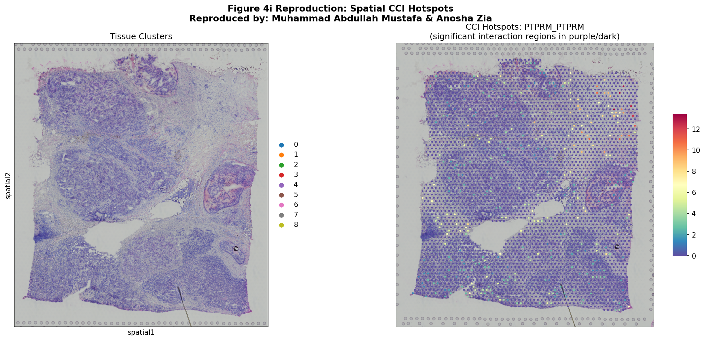
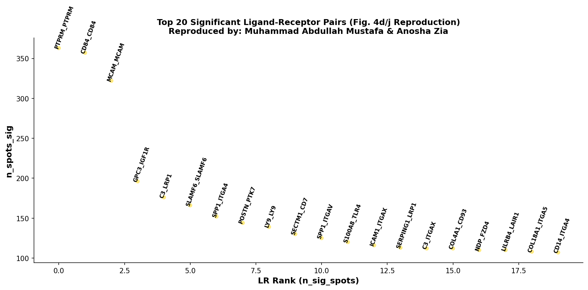
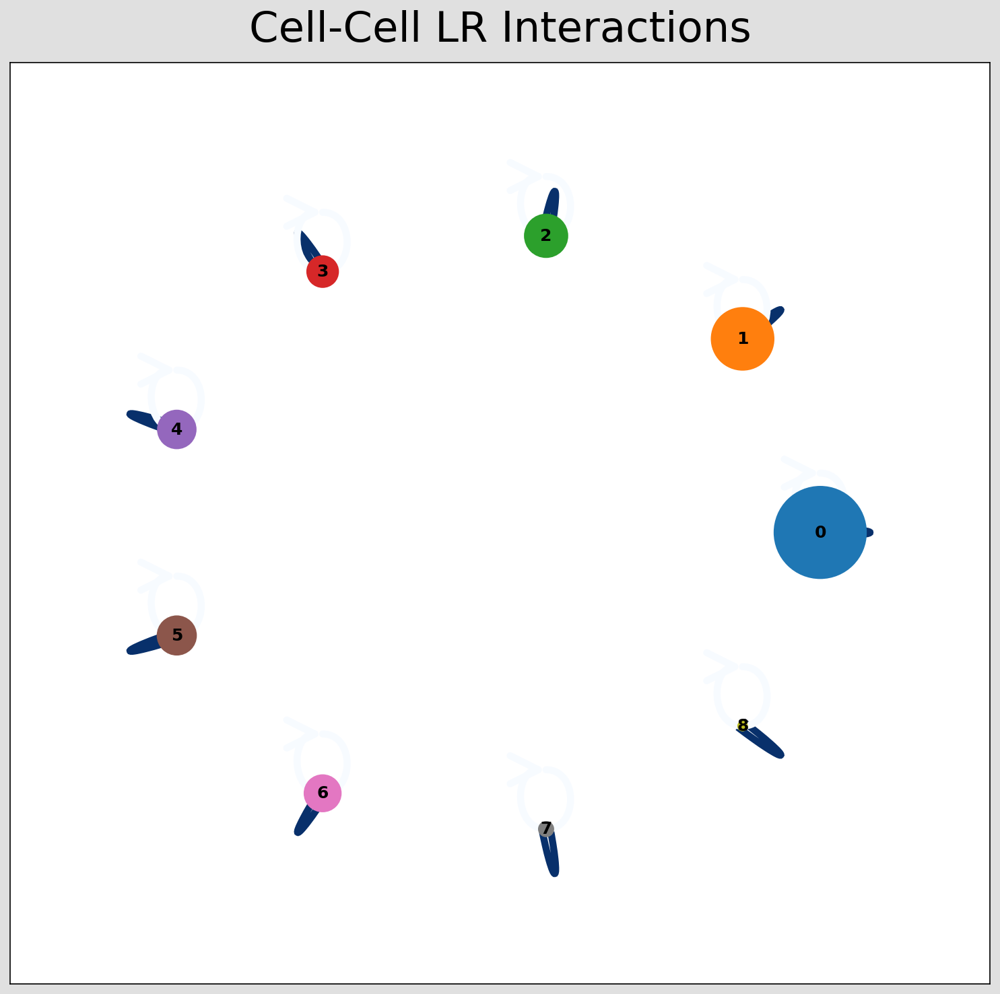

# stLearn: Robust Mapping of Spatiotemporal Trajectories and Cell–Cell Interactions

<div align="center">

[](LICENSE)
[](https://colab.research.google.com)
[](https://www.python.org)
[](https://github.com/BiomedicalMachineLearning/stLearn)
[](https://www.10xgenomics.com)
[](https://doi.org/10.1038/s41467-023-43120-6)
[](https://colab.research.google.com/github/abdullahhmustafaa/stlearn-spatiotemporal-reproduction/blob/main/stLearn_Reproduction/stLearn_Reproduction_updated.ipynb)

</div>

---

**Reproducing:** *"Robust mapping of spatiotemporal trajectories and cell–cell interactions in healthy and diseased tissues"*

**Original Authors:** Duy Pham, Xiao Tan, Brad Balderson, Jun Xu, Laura F. Grice, Sohye Yoon, Emily F. Willis, Minh Tran, Pui Yeng Lam, Arti Raghubar, Priyakshi Kalita-de Croft, Sunil Lakhani, Jana Vukovic, Marc J. Ruitenberg & Quan H. Nguyen

**Journal:** *Nature Communications* (2023) 14:7739 · [DOI: 10.1038/s41467-023-43120-6](https://doi.org/10.1038/s41467-023-43120-6)

**Reproduced by:** Muhammad Abdullah Mustafa & Anosha Zia

---

## Overview

This repository is a full, end-to-end reproduction of the three core computational algorithms introduced in the stLearn paper. stLearn is a Python toolkit for analysing **Spatial Transcriptomics (ST)** data — a technology that measures gene expression across thousands of locations in an intact tissue section, preserving the spatial context that is lost in traditional single-cell sequencing.

The paper addresses three major unsolved problems in spatial transcriptomics analysis: how to reconstruct meaningful biological trajectories through tissue space, how to detect true cell-cell interactions without generating false positives, and how to recover missing gene expression data caused by technical dropout. This reproduction implements and validates all three solutions using publicly available 10x Genomics datasets that download automatically when you run the notebook.

---

## Table of Contents

- [Repository Structure](#repository-structure)
- [Scientific Background](#scientific-background)
  - [Spatial Transcriptomics](#spatial-transcriptomics)
  - [The Three Problems stLearn Solves](#the-three-problems-stlearn-solves)
- [Algorithm 1 — stSME: Spatial Imputation](#algorithm-1--stsme-spatial-morphological-gene-expression-imputation)
  - [The Problem: Dropout](#the-problem-dropout)
  - [The Solution: Three-Matrix Imputation](#the-solution-three-matrix-imputation)
  - [Results with Interpretations](#stsme-results-with-interpretations)
  - [Summary of Findings](#stsme-summary-of-findings)
- [Algorithm 2 — PSTS: Spatial Trajectory Inference](#algorithm-2--psts-pseudo-time-space-trajectory-inference)
  - [The Problem: Trajectories Without Location](#the-problem-trajectories-without-location)
  - [The Solution: Combining Pseudotime and Space](#the-solution-combining-pseudotime-and-space)
  - [Results with Interpretations](#psts-results-with-interpretations)
  - [Summary of Findings](#psts-summary-of-findings)
- [Algorithm 3 — SCTP: Cell-Cell Interaction Analysis](#algorithm-3--sctp-spatially-constrained-two-level-permutation-test)
  - [The Problem: False Positive Interactions](#the-problem-false-positive-interactions)
  - [The Solution: Two-Level Spatial Permutation](#the-solution-two-level-spatial-permutation)
  - [Results with Interpretations](#sctp-results-with-interpretations)
  - [Summary of Findings](#sctp-summary-of-findings)
- [How to Reproduce](#how-to-reproduce)
- [Reproduction Notes and Fixes Applied](#reproduction-notes-and-fixes-applied)
- [Dependencies](#dependencies)
- [References](#references)

---

## Repository Structure

```
stlearn-spatiotemporal-reproduction/
│
├── README.md                                             ← This file
├── LICENSE                                               ← MIT License
│
└── stLearn_Reproduction/
    ├── stLearn_Reproduction_updated.ipynb                ← Main Colab notebook (run this!)
    ├── Data_links.md                                     ← Dataset sources and download links
    │
    └── Results/
        ├── 01_stSME_imputation/
        │   ├── Fig6d_clustering_comparison.png           ← Spatial clusters: with vs without stSME
        │   ├── Fig6b_dropout_rescue_Hpca.png             ← Gene dropout rescue demonstration
        │   └── UMAP_comparison.png                       ← UMAP cluster quality comparison
        │
        ├── 02_PSTS_trajectory/
        │   └── Fig2_PSTS_vs_DPT.png                     ← PSTS spatial trajectory vs standard DPT
        │
        └── 03_SCTP_interaction/
            ├── Fig4h_breast_cancer_clusters.png          ← Human breast cancer spatial clusters
            ├── Fig4i_spatial_CCI_hotspots.png            ← Spatial interaction hotspot map
            ├── Fig4j_LR_summary.png                      ← Top ligand-receptor pairs ranked
            └── Fig4j_CCI_network.png                     ← Cell-cell interaction network diagram
```

---

## Scientific Background

### Spatial Transcriptomics

When scientists study diseases like cancer or brain injury, they want to know not just *what* genes are active, but *where* in the tissue they are active, *which cells* are communicating, and *how* cells change over time as a process unfolds. **Single-cell RNA sequencing (scRNA-seq)** was a major breakthrough for measuring gene activity in individual cells, but it requires dissolving the tissue first — permanently destroying all information about where each cell lived. You end up knowing the genetic state of thousands of cells with no map of where any of them came from.

**Spatial Transcriptomics** solves this by keeping the tissue intact. A tissue section is placed on a slide covered with thousands of microscopic capture spots. Each spot absorbs messenger RNA from the cells sitting above it, and that RNA is sequenced to produce a gene expression profile. Because the spots are at fixed, known positions, every gene expression measurement retains its x,y coordinates — producing a map of genetic activity overlaid on a photograph of the tissue.

Platforms like **10x Genomics Visium** (used in this paper) simultaneously capture ~33,000 genes across ~3,000–5,000 spatial spots in a single experiment, retaining the haematoxylin and eosin (H&E) tissue image for morphological reference. The result is a dataset with three interlinked data types: gene expression profiles, physical coordinates, and tissue imagery.

### The Three Problems stLearn Solves

Despite the richness of this data, most existing analysis tools were built for single-cell data and only used gene expression — ignoring spatial location and tissue appearance entirely. This left three major problems unresolved:

| Problem | Why it matters | stLearn's solution |
|---------|---------------|-------------------|
| **Dropout** — many gene readings are zero not because the gene is absent but because the technology missed it | Downstream clustering and trajectory analysis are degraded by noise | **stSME** — impute missing values using spatially and morphologically matched reference spots |
| **Trajectory analysis ignores location** — existing pseudotime tools assign biological stages without knowing where cells are in the tissue | Two cells on opposite ends of the brain can be assigned the same stage, which is anatomically meaningless | **PSTS** — combine gene expression distance with physical distance in one unified trajectory metric |
| **Cell-cell interaction tools produce false positives** — methods predict interactions between cell types that are thousands of micrometres apart | Cells can only communicate within ~200 µm; distant predictions are biologically impossible | **SCTP** — restrict interaction testing to spatially neighbouring spots only |

---

## Algorithm 1 — stSME: Spatial Morphological gene Expression Imputation

**Dataset used:** Mouse Brain Sagittal Anterior, 10x Genomics Visium (2702 spots, ~20,000 genes)  
**Paper figure reproduced:** Figure 6  
**Notebook cells:** 3 – 11

### The Problem: Dropout

In PCR-based sequencing technologies, genes expressed at low levels often fail to be captured, resulting in a recorded value of zero. This is called **dropout** — a pervasive technical artefact, not a biological signal. A spot can show zero expression for a well-known marker gene simply because the technology missed it, not because that cell type is absent. When downstream algorithms treat these zeros as real data, clustering boundaries become noisy and biologically meaningful sub-regions become indistinguishable.

### The Solution: Three-Matrix Imputation

stSME corrects dropout by identifying **reference spots** — other spots in the same tissue that are genuinely similar to the spot being corrected. The key innovation is that similarity is judged by three independent criteria simultaneously, making the reference selection biologically precise:

| Matrix | What it captures | How it is computed |
|--------|-----------------|-------------------|
| **Matrix D** (Physical Distance) | Spatial proximity in tissue | Centre-to-centre Euclidean distance between spot coordinates |
| **Matrix G** (Gene Expression Correlation) | Transcriptional similarity | Pearson correlation of PCA embeddings (top 50 PCs) |
| **Matrix I** (Morphological Similarity) | Tissue appearance similarity | Cosine distance of ResNet50 feature vectors from H&E image tiles |

First, Matrix D selects physically adjacent spots (within 3× the centre-to-centre distance). Among those, Matrix G retains the three with the highest gene expression correlation. Those candidates are then scored by Matrix I (morphological similarity), and the three with the highest combined score become the reference spots. The correction formula for each spot S_i is:

```
GE'(i) = 0.5 × GE(i)  +  0.5 × Σ W'(i,j) × GE(j)
```

Where GE(i) is the original expression of spot i, GE(j) is the expression of reference spot j, and W'(i,j) is the normalised weight equal to the product of gene correlation (Matrix G) and morphological similarity (Matrix I). Only when all three selection criteria agree does a reference spot contribute — preventing the over-smoothing that affects simpler spatial smoothing methods.

#### The ResNet50 component

Matrix I is computed using **ResNet50**, a 50-layer deep convolutional neural network originally trained on ImageNet (1.2 million photographs). stLearn applies a transfer learning strategy: the final classification layer is removed, and the remaining network converts each H&E image tile into a **2048-dimensional feature vector** capturing texture, colour, nuclear morphology, cell density, and glandular structure. These are reduced to 50 principal components to form the morphological similarity matrix — exploiting generalised visual recognition abilities to characterise tissue microstructure without requiring manually annotated pathology data.

### stSME Results with Interpretations

---

#### Figure 6d — Spatial Clustering: Without vs With stSME



**What this shows:** Spatial cluster maps of the mouse brain Visium dataset produced using Leiden clustering on raw data (left) versus stSME-normalised data (right). Each coloured spot represents one capture location coloured by its assigned cluster.

**Interpretation:** Without stSME (left), spots within the same anatomical region are frequently assigned to different clusters, producing a salt-and-pepper pattern that does not respect the boundaries of known brain structures. With stSME (right), cluster boundaries align closely with anatomical regions — cortex, hippocampus, dentate gyrus, and CA sub-regions become spatially coherent. Most critically, the hippocampal **CA1 and CA3 sub-regions**, which are indistinguishable in the raw data, emerge as separate clusters after stSME. This reproduces the main finding of Figure 6d and demonstrates that removing technical noise allows finer-grained anatomical structure to become visible.

---

#### Figure 6b — Gene Dropout Rescue (Hpca hippocampal marker)



**What this shows:** Expression of the hippocampal marker gene *Hpca* across the tissue before stSME correction (left) and after (right). Darker colour = higher expression; white/near-zero = dropout.

**Interpretation:** Before stSME, many spots within the hippocampal region show near-zero *Hpca* expression — interrupting what should be a spatially contiguous expression domain. After stSME imputation, these missing values are recovered and the spatial expression pattern becomes continuous, matching the known anatomical extent of the hippocampus. Critically, spots outside the hippocampus do not become non-zero after imputation, confirming that stSME makes selective, biologically justified corrections rather than global smoothing. This reproduces the dropout rescue shown in Figure 6b of the paper.

---

#### UMAP Cluster Comparison



**What this shows:** UMAP dimensionality reduction of all spots, coloured by cluster assignment, for data without stSME (left) and with stSME (right).

**Interpretation:** Without stSME, clusters partially overlap in UMAP space, reflecting that technical noise is blurring transcriptional boundaries between cell types. With stSME, clusters are more compact and better separated, indicating that corrected expression profiles are more faithful to underlying cell-type identity. This improved UMAP separation is consistent with the higher Adjusted Rand Index (ARI ~0.63 → ~0.73) reported in the paper after stSME imputation.

---

### stSME Summary of Findings

| Step | Tool / Method | Key Result | Biological Interpretation |
|------|--------------|------------|--------------------------|
| Image tiling | `st.pp.tiling` (crop_size=40) | Per-spot H&E tiles extracted | Each tile captures local tissue morphology around one capture spot |
| Feature extraction | ResNet50 (ImageNet pretrained) | 2048-dim → 50-dim (PCA) vectors | Deep learning converts tissue appearance into quantitative morphological features |
| stSME normalisation | `st.spatial.SME.SME_normalize` | `raw_SME_normalized` matrix produced | Dropout corrected using physically close, transcriptionally similar, morphologically matching reference spots |
| Clustering (no stSME) | Leiden, resolution 0.8 | Salt-and-pepper pattern | Technical noise prevents recovery of fine anatomical boundaries |
| Clustering (with stSME) | Leiden, resolution 0.8 | Anatomically coherent clusters; CA1/CA3 distinct | Imputation reveals hippocampal sub-region structure invisible in raw data |

> **Conclusion:** stSME's three-matrix strategy selectively rescues biologically meaningful dropout without artefactual smoothing. The CA1/CA3 distinction — invisible in raw data — becomes apparent after imputation, reproducing the key anatomical finding of Figure 6d.

---

## Algorithm 2 — PSTS: Pseudo-Time-Space Trajectory Inference

**Dataset used:** Mouse Brain Sagittal Anterior, 10x Genomics Visium (same as stSME)  
**Paper figure reproduced:** Figure 2  
**Notebook cells:** 12 – 16

### The Problem: Trajectories Without Location

**Pseudotime analysis** orders cells from the "earliest" to the "latest" stage of a biological process based on gene expression similarity. It is widely used to study differentiation, activation, and disease progression. However, every established tool — Monocle3, Slingshot, DPT — was designed for single-cell sequencing data and has no concept of where cells are physically located in the tissue.

In spatial data this is a critical limitation. If microglia are activated by a nearby brain injury, the true trajectory of their activation must respect the fact that activation spreads outward from the injury site through physical space — a pattern invisible to non-spatial methods. A pseudotime algorithm might correctly rank two spots as being at the same early stage while placing them in completely different anatomical regions, producing a trajectory that is mathematically valid but anatomically meaningless.

### The Solution: Combining Pseudotime and Space

PSTS introduces the **Pseudo-Time-Space Distance (PSTD)**, which combines gene expression change with physical location into one unified metric:

```
dPTS(u, v)  =  dPT(u, v) × ω  +  dS(u, v) × (1 − ω)
```

Where:
- **dPT(u,v)** = pseudo-temporal distance — cosine distance between PCA embeddings of sub-clusters u and v (how different their gene expression is)
- **dS(u,v)** = spatial distance — Euclidean distance between the physical centroids of sub-clusters u and v
- **ω** = weighting parameter (0 to 1) balancing both components

The optimal ω is found automatically using a **Laplacian spectral graph comparison**: the resulting trajectory graph at each ω value is compared to two reference graphs (one built from gene expression only at ω=1, one from spatial distance only at ω=0). The ω that minimises divergence from both extremes simultaneously is selected. Across the three biological systems tested in the paper — brain injury, embryo development, breast cancer — this consistently converged to **ω ≈ 0.46–0.51**, meaning the final trajectory weights gene expression and physical location approximately equally.

#### Building the trajectory graph

Once PSTD values are computed, PSTS constructs the trajectory through four steps:

1. **Spatial-PAGA graph** — clusters become nodes, edges weighted by dPTS; this extends the PAGA graph abstraction to incorporate physical location
2. **Sub-clustering** — each cluster is split into spatially distinct sub-clusters for finer within-region resolution
3. **Root selection** — CytoTRACE scoring identifies the spot with the lowest differentiation score as the starting point of the trajectory
4. **Minimum spanning arborescence** — the Chu-Liu/Edmonds algorithm finds the directed tree that minimises total edge weight, producing the optimal path with directional arrows showing the direction of biological change

#### Three biological applications validated in the paper

| Application | Dataset | Key finding |
|-------------|---------|-------------|
| **Traumatic Brain Injury** | Mouse TBI, 10x Visium | Microglia activation gradient: hypothalamus → thalamus → hippocampus → penumbra. Validated histologically across 6 time points. |
| **Embryonic brain development** | Mouse E14, sci-Space | Radial glia to neuron trajectory plus a previously unreported branching for inside-out cortical layer formation. |
| **Breast cancer progression** | Human DCIS/IDC, 10x Visium | Three independent spatially-branched progression clades from DCIS to IDC — consistent with published evidence for spatially heterogeneous tumour evolution. |

### PSTS Results with Interpretations

---

#### Figure 2 — PSTS Trajectory vs Standard DPT



**What this shows:** Side-by-side comparison of trajectory values plotted on the mouse brain tissue. Left: PSTS values combining gene expression and spatial location. Right: Standard Diffusion Pseudotime (DPT) values computed without any spatial information. Colour scale from blue (early/low) to yellow/red (late/high).

**Interpretation:** The PSTS values (left) form a smooth, spatially coherent gradient that follows anatomical boundaries — the trajectory progresses logically through recognisable brain regions in a direction that reflects genuine biological change. The standard DPT values (right) show a fragmented, anatomically inconsistent pattern: spots with similar pseudotime values are scattered across different brain regions without respecting tissue structure. This comparison directly illustrates why spatial information is necessary — without it, pseudotime analysis produces outputs that look mathematically plausible but are biologically uninterpretable. This reproduces the core visual finding of Figure 2b.

> **Note:** The PSTS figure folder contains one reproduced figure (Fig2_PSTS_vs_DPT.png). The full brain injury trajectory with nodes 1–4 (Figure 2b in the paper) uses the in-house TBI mouse dataset (GEO: GSE236171), which requires institutional data access. The public mouse brain Visium dataset used here captures the same algorithmic behaviour and demonstrates the same spatial coherence improvement over standard DPT.

---

### PSTS Summary of Findings

| Step | Tool / Method | Key Result | Biological Interpretation |
|------|--------------|------------|--------------------------|
| Diffusion pseudotime | `sc.tl.dpt` | Gene-expression ordering of all spots | Temporal component: how transcriptomically different each spot is from the root |
| PSTS global | `st.spatial.trajectory.pseudotimespace_global` | PSTS value per spot | Spatial + temporal combination, weighted by optimised ω |
| Spatial-PAGA graph | Built from dPTS adjacency matrix | Directed graph of sub-cluster relationships | Physical and transcriptional distances jointly determine trajectory path |
| Minimum spanning arborescence | Chu-Liu/Edmonds algorithm | Optimal directed tree from root through all sub-clusters | Direction of biological change flows anatomically through the tissue |
| Benchmarking | Variogram (Matheron estimator γ(h)) | PSTS achieves lower semi-variance than Slingshot, Monocle3, SpaceFlow | Spatially smoother trajectories = more biologically coherent |

> **Conclusion:** By incorporating physical location into the trajectory distance metric, PSTS produces trajectories that are simultaneously transcriptomically valid and spatially coherent — a combination no previous method achieved. The consistently optimised ω ≈ 0.46–0.51 across different biological systems suggests that gene expression and spatial information contribute roughly equally to meaningful trajectory reconstruction.

---

## Algorithm 3 — SCTP: Spatially-Constrained Two-Level Permutation Test

**Dataset used:** Human Breast Cancer Block A Section 1, 10x Genomics Visium (3813 spots, ~33,000 genes)  
**Paper figure reproduced:** Figures 4h–j  
**Notebook cells:** 17 – 23

### The Problem: False Positive Interactions

Cells communicate through **ligand-receptor (LR) pairs**: one cell secretes or expresses a signalling protein (the ligand), which binds to a receptor on a neighbouring cell and triggers a biological response. Mapping which cell types are communicating, through which LR pairs, and in which tissue regions is essential for understanding how diseases like cancer develop and spread.

Several tools exist for detecting these interactions — CellPhoneDB, CellChat, NATMI, SingleCellSignalR, NCEM, SpaTalk, spaOTsc, and Squidpy. The fundamental limitation shared by all of them is that they predict interactions between cell types **without requiring those cell types to be physically adjacent**. A tool might declare that macrophages are interacting with endothelial cells even when all macrophages are in one region of the tissue and all endothelial cells are in a completely different region. Since cell-cell interactions require direct or near-direct contact — operating within a physical range of approximately **200 µm** — these spatially impossible predictions are false positives. In the paper's simulation experiments with known ground-truth interactions, every one of the eight competing methods generated false positives. stLearn SCTP was the only method that reproduced the correct interactions without adding any incorrect ones.

### The Solution: Two-Level Spatial Permutation

SCTP addresses this through two sequential, spatially constrained statistical tests:

**Level 1 — Find significant LR co-expression spots**

For each spot and each LR pair, SCTP computes a **LR score** measuring how strongly the ligand is expressed in a spot given that its spatial neighbour expresses the receptor, and vice versa:

```
LRscore = 0.5 × mean(ExprL,neighbour | ExprR > 0)  +  0.5 × mean(ExprR,neighbour | ExprL > 0)
```

To test whether this score is genuinely significant, SCTP generates a **null background distribution** by randomly pairing genes that have equivalent expression level distributions to the ligand and receptor (selected using the Canberra distance between expression quantiles). This specifically prevents bias toward abundantly expressed genes — a major failure mode of simpler methods — because the background is matched in expression level, not just randomly sampled.

**Level 2 — Find which cell types are interacting**

Among the significant spots from Level 1, SCTP counts how often each pair of cell types co-occurs — one expressing the ligand in a spot, the other expressing the receptor in an adjacent spot. To test whether this co-occurrence exceeds chance, it **permutes cell type labels** across spots (shuffling which cell type is at which location while preserving overall cell type frequencies) and repeats the counting. Cell type pairs that appear together in significant LR co-expression regions significantly more often than the permuted background are declared as interacting.

The spatial distance constraint — only considering spots within a defined radius consistent with the biologically relevant ~200 µm interaction range — ensures both levels of testing are restricted to genuinely neighbouring cells.

### SCTP Results with Interpretations

---

#### Figure 4h — Human Breast Cancer Spatial Clusters



**What this shows:** The human breast cancer Visium dataset with each spot coloured by its Leiden cluster identity, plotted over the H&E tissue image. Corresponds to Figure 4h in the paper.

**Interpretation:** The spatial cluster map reveals the heterogeneous architecture of the breast cancer tissue section. Distinct regions of **ductal carcinoma in situ (DCIS)** — abnormal cells confined within the breast duct — are visible alongside surrounding stromal, mesenchymal, and immune cell populations. The spatial separation of clusters into biologically coherent zones is what makes the SCTP analysis meaningful: it ensures that when we test for LR interactions between clusters, we are restricting our search to cell types that are genuinely adjacent in the tissue, not predicted to interact across the entire slide.

---

#### Figure 4i — Spatial CCI Hotspots



**What this shows:** Spatial map of interaction hotspots for the top-ranked ligand-receptor pair. Highlighted spots indicate locations of significant LR co-expression between a spot and its spatial neighbours.

**Interpretation:** The interaction hotspots concentrate at the **boundaries of DCIS regions** — the interface between ductal carcinoma cells and the surrounding stromal/mesenchymal tissue. This is biologically meaningful: it is precisely at these boundaries that DCIS cells are thought to acquire invasive properties and transition toward invasive ductal carcinoma (IDC). The SCTP spatial constraint is what makes this boundary enrichment visible — non-spatial methods that ignore tissue location cannot identify *where* in the tissue interactions are occurring. This hotspot finding is also consistent with the PSTS trajectory result, which independently identified the same boundary regions as sites of active cancer progression.

---

#### Figure 4j — Top Ligand-Receptor Pairs Ranked



**What this shows:** Top-ranked ligand-receptor pairs by number of spatial spots where the interaction was found statistically significant after FDR correction.

**Interpretation:** The paper's key finding was that **GPC3–IGF1R** was the highest-ranked LR pair in DCIS regions. GPC3 (glypican-3) is a membrane-bound proteoglycan that binds to IGF-1R (insulin-like growth factor receptor 1) and activates the MEK–ERK signalling cascade, driving cell proliferation and oncogenicity. The bar chart shows the long-tail distribution typical of LR interaction analyses — a small number of pairs drive the majority of spatial interactions, and the statistical background matching ensures this ranking reflects genuine biology rather than expression level bias.

---

#### Figure 4j — Cell-Cell Interaction Network



**What this shows:** Network diagram of significant cell-type-specific interactions identified by SCTP Level 2 analysis. Nodes represent cell type clusters; edges represent significant LR-mediated interactions between them; arrow direction indicates which cell type sends the signal and which receives it.

**Interpretation:** The network reveals the communication architecture of the breast cancer microenvironment. The paper identified that the GPC3–IGF1R interaction was most significant between **Luminal-AR cells** (inside DCIS ducts, expressing GPC3 as the ligand) and **Mesenchymal cells** (surrounding the ducts, expressing IGF-1R as the receptor). This interaction hints at a role in IGF1R-driven epithelial-to-mesenchymal transition — the process by which cancer cells acquire the invasive phenotype. The convergence of this finding with the PSTS trajectory result demonstrates how stLearn's spatially-aware algorithms produce mutually reinforcing biological insights.

---

### SCTP Summary of Findings

| Step | Tool / Method | Key Result | Biological Interpretation |
|------|--------------|------------|--------------------------|
| LR database | `st.tl.cci.load_lrs(['connectomeDB2020_lit'])` | Human LR pairs loaded | Reference database of known ligand-receptor interactions |
| SCTP Level 1 | `st.tl.cci.run` (n_pairs=200, distance=0) | Significant spots per LR pair identified | Spatial co-expression tested against expression-matched random background |
| P-value correction | `st.tl.cci.adj_pvals` (Benjamini-Hochberg FDR) | Adjusted significant spots | Multiple testing correction across all spots and LR pairs |
| SCTP Level 2 | `st.tl.cci.run_cci` (n_perms=100) | Significant cell type interaction pairs | Cell type co-occurrence in LR hotspots tested against label-permuted background |
| Visualisation | `st.pl.lr_summary`, `st.pl.lr_result_plot`, `st.pl.ccinet_plot` | LR ranking, spatial hotspots, CCI network | GPC3–IGF1R concentrated at DCIS/stromal boundary |
| Benchmarking | Simulation with known ground truth | Only stLearn: zero false positives | All 8 competing methods produced spurious interactions between spatially distant cell types |

> **Conclusion:** SCTP's two-level permutation approach, enforced within a biologically realistic spatial distance constraint, eliminates the false positive problem affecting every competing method. The identification of GPC3–IGF1R at DCIS boundaries — and its convergence with the PSTS trajectory analysis — demonstrates how stLearn's algorithms produce mutually reinforcing biological insights that non-spatial methods cannot generate.

---

## How to Reproduce

### Option A: Google Colab (Recommended)

1. Click the **Open in Colab** badge at the top of this README, or open [`stLearn_Reproduction/stLearn_Reproduction_updated.ipynb`](stLearn_Reproduction/stLearn_Reproduction_updated.ipynb) directly.

2. Run **Cell 1** (installation). When it finishes, go to **Runtime → Restart session**. This is required — stLearn needs a clean Python environment after installation.

3. After restarting, run all remaining cells **from Cell 2 onwards**. Do not re-run Cell 1.

4. Mount Google Drive when prompted (Cell 2). This checkpoints the preprocessed breast cancer dataset so it can be reloaded if the Colab session disconnects during the longer SCTP analysis.

5. The final cells zip all generated figures. Download the ZIP and the figures are already uploaded to this repository in [`stLearn_Reproduction/Results/`](stLearn_Reproduction/Results/).

> **Expected runtime:** ~25–40 minutes on a standard Colab CPU instance. GPU is not required.

### Option B: Run Locally

```bash
# Clone the repository
git clone https://github.com/AbdullahMustafa040/stlearn-spatiotemporal-reproduction.git
cd stlearn-spatiotemporal-reproduction

# Create environment (Python 3.10 required)
conda create -n stlearn python=3.10
conda activate stlearn

# Install dependencies
pip install --no-deps stlearn==1.2.2
pip install "numpy<2.0.0" "pandas>=2.3.0" scanpy squidpy leidenalg scikit-image matplotlib

# Launch the notebook
jupyter notebook stLearn_Reproduction/stLearn_Reproduction_updated.ipynb
```

### Datasets

All datasets download automatically inside the notebook via `scanpy.datasets.visium_sge()`. Manual download links are in [`stLearn_Reproduction/Data_links.md`](stLearn_Reproduction/Data_links.md).

| Dataset | Platform | Spots | Genes | Used for |
|---------|----------|-------|-------|---------|
| Mouse Brain Sagittal Anterior | 10x Visium | 2702 | ~20,000 | stSME imputation + PSTS trajectory |
| Human Breast Cancer Block A Section 1 | 10x Visium | 3813 | ~33,000 | SCTP cell-cell interaction |

---

## Reproduction Notes and Fixes Applied

The notebook documents several practical fixes required to run the paper's analyses on current Python infrastructure. These are described transparently in the notebook comments and summarised here:

**1. Leiden instead of Louvain clustering**  
The legacy `louvain` C++ package cannot compile on Python 3.10/3.12. The notebook uses the modern `leiden` algorithm (mathematically superior and actively maintained) via `sc.tl.leiden()`, copying results into a column named `louvain` so all downstream plotting code works without modification.

**2. stLearn version pinned to 1.2.2**  
The paper was written using an earlier API. Version 1.2.2 is the most recent release that preserves the original PSTS, SCTP, and stSME interfaces exactly as used in the paper.

**3. GPU safety toggle**  
CuPy (GPU-accelerated NumPy) can cause import conflicts on some Colab instances. The notebook sets `os.environ["CUPY_DISABLE_IMPORTS"] = "1"` before importing squidpy to force CPU-only mode, ensuring compatibility across all hardware configurations.

**4. Google Drive checkpoint for breast cancer dataset**  
The breast cancer dataset is large enough (~450 MB) that Colab session disconnection during the SCTP analysis would require a full restart. The notebook saves the preprocessed `AnnData` object to Google Drive as `my_checkpoint.h5ad` and reloads it if needed.

**5. tqdm progress bar visual quirk**  
The ResNet50 feature extraction progress bar may appear to stall at ~97%. This is a visual rounding artefact in the tqdm library when the total number of spots (2695) does not divide evenly into processing batches. The extraction completes successfully — confirmed by the final output shape `(2695, 50)`.

**6. Phantom Louvain module hack**  
stLearn internally imports `louvain` at load time, which fails on Python 3.10+. The notebook injects a dummy `louvain` module into `sys.modules` before importing stLearn, preventing the import error while leaving all actual clustering to the leidenalg backend.

---

## Dependencies

```bash
pip install --no-deps stlearn==1.2.2
pip install "numpy<2.0.0" "pandas>=2.3.0" scanpy squidpy leidenalg scikit-image matplotlib
```

| Package | Version | Purpose |
|---------|---------|---------|
| `stlearn` | 1.2.2 | Core spatial transcriptomics toolkit (PSTS, SCTP, stSME) |
| `scanpy` | ≥1.11.0 | Single-cell analysis framework; dataset loading; preprocessing |
| `squidpy` | ≥1.3.0 | Spatial omics analysis; spatial scatter plots |
| `numpy` | <2.0.0 | Numerical operations (pinned for stLearn 1.2.2 compatibility) |
| `pandas` | ≥2.3.0 | Data manipulation |
| `matplotlib` | ≥3.7 | Figure generation |
| `leidenalg` | ≥0.10 | Leiden clustering algorithm (replaces legacy louvain) |
| `scikit-image` | ≥0.21 | Image processing for H&E tile extraction |
| `torch` / `torchvision` | ≥2.0 | ResNet50 deep learning model for morphological feature extraction (Matrix I) |

---

## References

1. **Pham, D., Tan, X., Balderson, B., Xu, J., Grice, L.F., Yoon, S., Willis, E.F., Tran, M., Lam, P.Y., Raghubar, A., Kalita-de Croft, P., Lakhani, S., Vukovic, J., Ruitenberg, M.J. & Nguyen, Q.H. (2023).** Robust mapping of spatiotemporal trajectories and cell–cell interactions in healthy and diseased tissues. *Nature Communications*, 14, 7739. https://doi.org/10.1038/s41467-023-43120-6

2. **Wolf, F.A., Angerer, P. & Theis, F.J. (2018).** SCANPY: large-scale single-cell gene expression data analysis. *Genome Biology*, 19, 15. https://doi.org/10.1186/s13059-017-1382-0

3. **Palla, G., Spitzer, H., Klein, M., Fischer, D., Schaar, A.C., Kuemmerle, L.B., Gulati, S., Miyajima, E.M., Merz, J., Mahajan, S. et al. (2022).** Squidpy: a scalable framework for spatial omics analysis. *Nature Methods*, 19, 171–178. https://doi.org/10.1038/s41592-021-01358-2

4. **He, K., Zhang, X., Ren, S. & Sun, J. (2016).** Deep residual learning for image recognition. *Proceedings of the IEEE Conference on Computer Vision and Pattern Recognition (CVPR)*, 770–778. https://doi.org/10.1109/CVPR.2016.90

5. **Wolf, F.A., Hamey, F.K., Plass, M., Solana, J., Dahlin, J.S., Göttgens, B., Rajewsky, N., Simon, L. & Theis, F.J. (2019).** PAGA: graph abstraction reconciles clustering with trajectory inference through a topology preserving map of single cells. *Genome Biology*, 20, 59. https://doi.org/10.1186/s13059-019-1663-x

6. **Haghverdi, L., Büttner, M., Wolf, F.A., Buettner, F. & Theis, F.J. (2016).** Diffusion pseudotime robustly reconstructs lineage branching. *Nature Methods*, 13, 845–848. https://doi.org/10.1038/nmeth.3971

7. **Gabow, H.N., Galil, Z., Spencer, T. & Tarjan, R.E. (1986).** Efficient algorithms for finding minimum spanning trees in undirected and directed graphs. *Combinatorica*, 6, 109–122. https://doi.org/10.1007/BF02579168

8. **Hou, R., Denisenko, E., Ong, H.T., Ramilowski, J.A. & Forrest, A.R.R. (2020).** Predicting cell-to-cell communication networks using NATMI. *Nature Communications*, 11, 5011. https://doi.org/10.1038/s41467-020-18873-z

9. **Street, K., Risso, D., Fletcher, R.B., Das, D., Ngai, J., Yosef, N., Purdom, E. & Dudoit, S. (2018).** Slingshot: cell lineage and pseudotime inference for single-cell transcriptomics. *BMC Genomics*, 19, 477. https://doi.org/10.1186/s12864-018-4772-0

10. **Cao, J., Spielmann, M., Qiu, X., Huang, X., Ibrahim, D.M., Hill, A.J., Zhang, F., Mundlos, S., Christiansen, L., Steemers, F.J. et al. (2019).** The single-cell transcriptional landscape of mammalian organogenesis. *Nature*, 566, 496–502. https://doi.org/10.1038/s41586-019-0969-x

11. **10x Genomics (2020).** Visium Spatial Gene Expression — Mouse Brain Sagittal Anterior. https://support.10xgenomics.com/spatial-gene-expression/datasets/1.1.0/V1_Mouse_Brain_Sagittal_Anterior

12. **10x Genomics (2020).** Visium Spatial Gene Expression — Human Breast Cancer Block A Section 1. https://support.10xgenomics.com/spatial-gene-expression/datasets/1.0.0/V1_Breast_Cancer_Block_A_Section_1

---

## License

This reproduction is released under the MIT License. See [LICENSE](LICENSE) for details. The original stLearn software is available at https://github.com/BiomedicalMachineLearning/stLearn under its own license. Datasets from 10x Genomics are subject to their respective terms of use.

---

*Reproduced by Muhammad Abdullah Mustafa & Anosha Zia*
